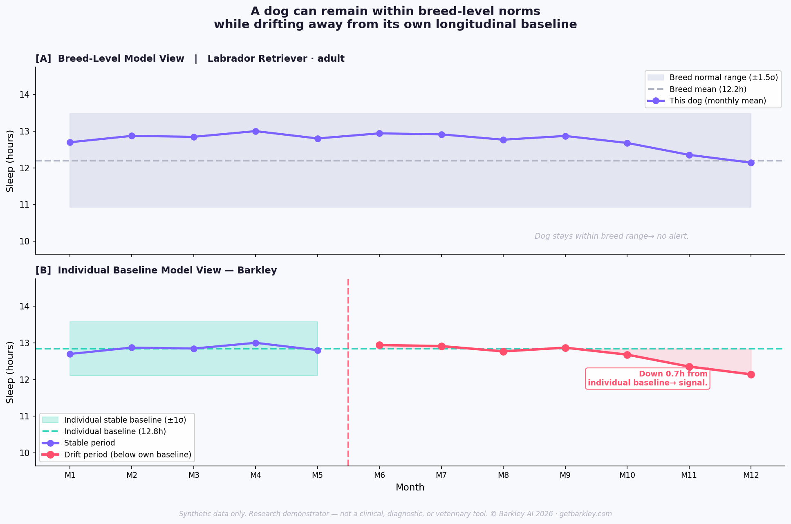
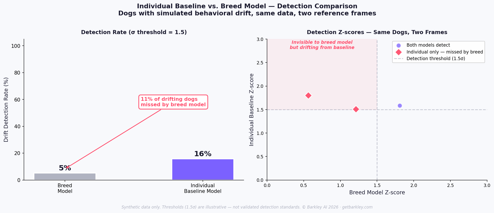

# Barkley Canine Cognition Lab

> *Existing research models canine cognition at the breed level.*  
> *Barkley explores modeling it at the individual level, over time.*

[](LICENSE-CODE-MIT.md)
[](LICENSE-DOCS-CC-BY-NC-4.0.md)
[](https://www.python.org/)
[]()
[]()
[](https://doi.org/10.5281/zenodo.20059956)
[](https://doi.org/10.5281/zenodo.20060326)

**This repository is a technical demonstrator of the DogGraph architecture using synthetic data. It is designed for behavioral informatics research and does not provide veterinary clinical diagnosis.**

> **Disclaimer.** This repository is a technical demonstrator using synthetic data only. It is not intended for clinical diagnosis, veterinary diagnosis, medical advice, or clinical decision-making.

---

## Public Research Artifacts

This repository is the main public hub for the Barkley Canine Cognition Lab. It connects the framework, synthetic dataset, interactive demonstrator, and reference implementation.

| Artifact | Role |
|---|---|
| [Drift Explorer](https://drift-explorer.getbarkley.com) | Interactive product demonstrator showing how individual baselines reveal hidden behavioral drift |
| [Synthetic DogGraph Dataset](https://huggingface.co/datasets/labs-barkley/synthetic-doggraph-sample) | Public synthetic data artifact for longitudinal canine behavioral trajectories |
| [Barkley Reference Architecture](https://github.com/labs-barkley/barkley-reference-architecture) | Source-available computational backbone — runnable research demonstrator |
| [Framework Paper](https://zenodo.org/records/20060327) | Conceptual foundation — DOI: [10.5281/zenodo.20060327](https://doi.org/10.5281/zenodo.20060327) |
| [Neo4j DogGraph Demo](./neo4j-doggraph-demo) | Graph-native representation of DogGraph — Proof of Usefulness / Neo4j track |
| [DogGraph Live App](https://doggraph.getbarkley.com/) | Self-hosted (Neo4j Community + Streamlit + Caddy) with the schema-constrained GraphRAG layer enabled |

---
## The One Figure to Understand Barkley



**Same dog. Same data. Two reference frames. Two different observations.**

- **Top panel** — breed-level model: the dog stays within its breed's normal range. No alert.
- **Bottom panel** — individual baseline model: the dog has drifted measurably from its own established behavioral history. Signal detected.

This is the methodological argument in one image. Breed-level models are blind to individual-level drift. Longitudinal individual models can see it.

---

## The Moment That Started This

A dog owner notices something. Not something dramatic — just a quietness that wasn't there before. A walk refused. A toy ignored. A look that holds for a second too long, then moves away.

The wearable says everything is normal. The breed average says this dog is fine.

But this dog was never average. *This* dog used to run to the door. *This* dog used to bark at the wind. The numbers haven't crossed a threshold. But the dog has changed — relative to itself.

That gap — between *normal for the breed* and *normal for this dog* — is what Barkley is built to close.

---

## The Detection Gap, Quantified



When the same dogs with simulated behavioral drift are evaluated against two reference frames, the gap is measurable. On this synthetic cohort, the individual baseline model surfaces drift in dogs that the breed model classifies as normal.

> *For a deep dive into the underlying ethological and methodological framework, see [`THESIS.md`](THESIS.md).*

---

## What This Repo Demonstrates

Three connected ideas, each as a runnable notebook:

| Notebook | Concept | Core Question | Methods |
|----------|---------|---------------|---------|
| [`01`](notebooks/01_breed_average_vs_individual_baseline.ipynb) | Individual Baseline vs. Breed Average | Is this dog behaviorally different from itself — not just from its breed? | Baseline modeling, detection-gap analysis |
| [`02`](notebooks/02_temporal_behavior_drift_detection.ipynb) | Temporal Behavioral Drift Detection | When does gradual change become a detectable signal? | Rolling Z-score, CUSUM, composite drift index |
| [`03`](notebooks/03_missing_data_as_behavioral_signal.ipynb) | Missing Data as Behavioral Signal | What does the *absence* of data tell us? | Absence taxonomy, quiet-streak encoding, imputation strategies |

**Reading path.** Start with **NB 01** for the *why*. Move to **NB 02** for the *how*. **NB 03** is the most original contribution — the **Missing Data Paradox**: data absence as structured behavioral feature, not noise.

---

## Quickstart

```bash
git clone https://github.com/labs-barkley/barkley-canine-cognition-lab.git
cd barkley-canine-cognition-lab
pip install -r requirements.txt
jupyter notebook notebooks/
```

The synthetic dataset is already included in `data/`. To regenerate it: `python src/generate_synthetic_data.py`.

---

## Repository Structure

```
barkley-canine-cognition-lab/
├── README.md                               ← You are here
├── THESIS.md                               ← Scientific argument (deep dive)
├── LICENSE.md                              ← Dual-license overview
├── LICENSE-CODE-MIT.md                     ← MIT (code)
├── LICENSE-DOCS-CC-BY-NC-4.0.md            ← CC BY-NC 4.0 (docs / figures / data)
├── requirements.txt
├── data/                                   ← Synthetic CSV + schema
├── notebooks/                              ← 3 runnable notebooks
├── src/                                    ← Generators + plotting utilities
├── figures/                                ← 14 figures generated by notebooks
└── docs/                                   ← Positioning, ethics, references
```

---

## Canonical Definitions — Barkley Behavioral Intelligence Glossary

These definitions are canonical across the Barkley ecosystem — this repository, [getbarkley.com](https://getbarkley.com/), the Zenodo records, and the machine-readable glossary ([llms.txt](https://getbarkley.com/llms.txt), JSON-LD `DefinedTermSet`). One concept, one definition, everywhere.

- **Behavioral Intelligence** — The modeling of an individual's behavior over time to produce interpretable signals about wellbeing, capability, and change — built on longitudinal data rather than single observations.
- **Behavioral Drift** — A slow, cumulative divergence of an individual's behavior away from its own baseline — typically invisible to population statistics because each step remains within the population's normal range.
- **Individual Baseline** — A per-individual longitudinal norm learned from that individual's own history, used as the reference frame for detecting change instead of a population average.
- **Reference Frame** — The comparison standard a model uses to decide whether a behavior is normal; the same data can yield opposite conclusions under different reference frames.
- **Longitudinal Intelligence** — Intelligence derived from modeling a subject continuously across time — trajectories, velocities, and rates of change — rather than from snapshots.
- **Reference Class** — The group an individual is compared against; the hidden variable of machine learning, because the choice of reference class changes what counts as anomalous.
- **Weak Signals** — Small, early behavioral changes — reduced recovery, altered exploration, informative silences — that precede clinically obvious change.
- **Behavioral Change Detection** — The task of detecting meaningful change in an individual's behavior as early as possible, benchmarked by lead time, recall, and false-alarm rate.

---

## Scientific Grounding

This framework draws on published research across three domains:

- **Duke Canine Cognition Center** — individual cognitive fingerprinting (Hare & Woods, 2013; Gnanadesikan et al., 2020)
- **Stanford health data mining methodologies** — temporal binning, electronic phenotyping (Shah, 2019; Banda et al., 2018)
- **Canine behavioral health literature** — Azkona et al. (2009), Salvin et al. (2010)

Full bibliography → [`docs/references.md`](docs/references.md)  
Scientific positioning → [`docs/scientific_positioning.md`](docs/scientific_positioning.md)  
Ethics and limitations → [`docs/ethics_and_limitations.md`](docs/ethics_and_limitations.md)

---

## What This Is — And What It Is Not

✅ A conceptual framework for individual-centric behavioral modeling  
✅ A technical demonstrator using synthetic data only  
✅ A research agenda with explicit limitations stated  
✅ An exploration of temporal drift detection and absence encoding methods  

❌ Not a clinical or diagnostic system  
❌ Not trained on real canine health data  
❌ Not a veterinary tool or medical product  
❌ Not making claims about validated behavioral detection performance  

---

## Privacy

This repository contains **no personal data** about dogs or their owners. The synthetic dataset was generated programmatically. In the context of companion animal behavioral monitoring, the owner's behavioral data (routines, location patterns, owner-absence events) is often as sensitive as the dog's. Any future extension to real behavioral data would require explicit informed consent, data minimization, purpose limitation, right to erasure, transparency, security by design, and veterinary ethical oversight. See [`docs/ethics_and_limitations.md`](docs/ethics_and_limitations.md).

---

## Publications & Citation

**Framework Paper** — the primary scientific reference for this repository:

> Remoissenet, E. P. (2026). *From Surveillance to Cognition: A Unified Framework for Precision Behavioral and Metabolic Intelligence in Companion Animals*. Barkley AI — Precision Behavioral Intelligence Series. DOI [10.5281/zenodo.20060327](https://doi.org/10.5281/zenodo.20060327)

**This repository** (code + notebooks + synthetic data):

> Remoissenet, E. P. (2026). *Barkley Canine Cognition Lab — Research framework and technical demonstrator for individual-centric canine behavioral modeling*. Zenodo. DOI: [10.5281/zenodo.20059956](https://doi.org/10.5281/zenodo.20059956)

---

## Next Milestone — Real-World Data Partner

This repository establishes the conceptual and technical foundations of the Barkley framework on synthetic data. The next milestone is a **research collaboration with a real-world canine behavioral data partner** — a veterinary informatics lab, an academic cohort study, an insurance partner with longitudinal claims data, or a sensor company with consented user data.

If your organization has access to longitudinal canine behavioral data and is interested in a research partnership, please reach out.

📩 **Research partnerships: [labs@getbarkley.com](mailto:labs@getbarkley.com)**

---

## Co-founder & Collaborator Search

Barkley is currently looking for technical collaborators and potential co-founder profiles interested in applied AI, canine cognition, behavioral modeling, multimodal data, and privacy-conscious product architecture.

If you are an engineer, ML researcher, product technologist, veterinary informatician, or scientific collaborator interested in building individual-centric behavioral intelligence for dogs — and the methodological position in this repository resonates with you — we would love to hear from you.

📩 **Contact: [labs@getbarkley.com](mailto:labs@getbarkley.com)**

---

## License

This repository uses a **dual-license structure**.

- **Code** (everything in `/src`, executable code in `/notebooks`) — released under the **MIT License**. See [`LICENSE-CODE-MIT.md`](LICENSE-CODE-MIT.md).
- **Documentation, thesis, figures, written explanations, and the synthetic dataset** — released under **Creative Commons Attribution-NonCommercial 4.0 International (CC BY-NC 4.0)**. See [`LICENSE-DOCS-CC-BY-NC-4.0.md`](LICENSE-DOCS-CC-BY-NC-4.0.md).
- **Barkley names, marks, logos, and brand assets** are not licensed for reuse. All trademark rights reserved.

Full overview: [`LICENSE.md`](LICENSE.md). For commercial licensing inquiries: **labs@getbarkley.com**.

> Patent applications pending (INPI, France · PCT international). All architectural methods, system components, and signal processing primitives described herein may be subject to intellectual property protection.

---

## Author

Created by **Elodie Remoissenet**, Founder of Barkley AI.

[](https://orcid.org/0009-0004-6031-659X)

For investor, co-founder, or research conversations:  
📩 **[labs@getbarkley.com](mailto:labs@getbarkley.com)** — general correspondence  
📩 **[elodie@getbarkley.com](mailto:elodie@getbarkley.com)** — corresponding author  
🔬 **ORCID:** [0009-0004-6031-659X](https://orcid.org/0009-0004-6031-659X)

---

*Barkley AI, 2026. Research framework and technical demonstrator using synthetic data only.*
