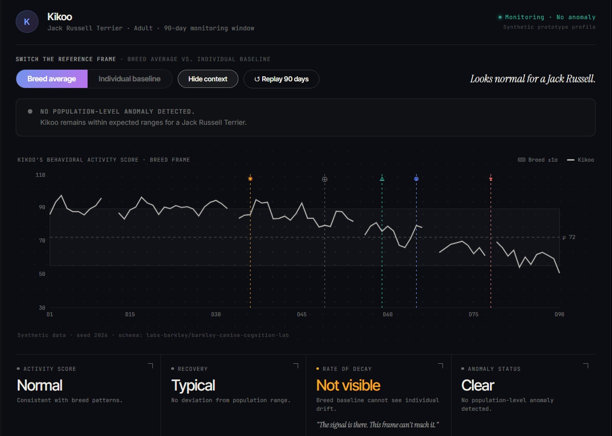
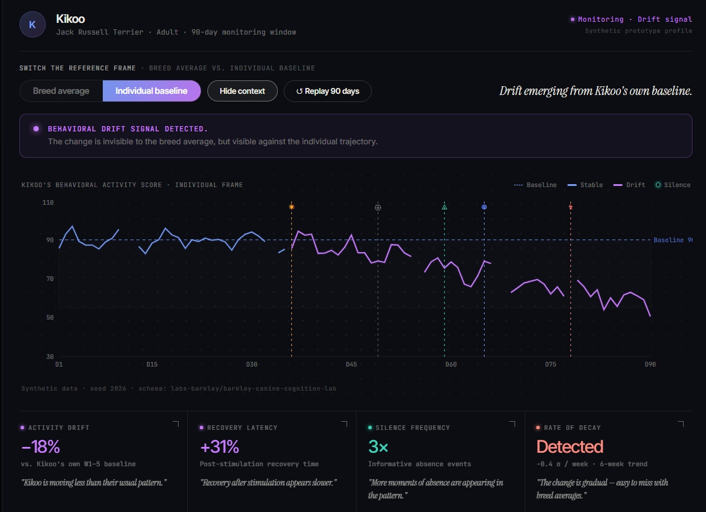
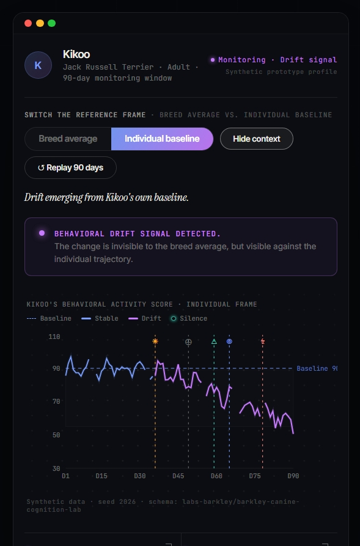

# Barkley Drift Explorer

**Behavioral Intelligence for Dogs — an interactive demonstrator.**

A front-end-only prototype that proves a single idea: a dog can look perfectly normal against its breed average while quietly drifting away from its *own* behavioral baseline.

🔗 **Live demo:** [drift-explorer.getbarkley.com](https://drift-explorer.getbarkley.com)

Part of the [Barkley Canine Cognition Lab](https://github.com/labs-barkley/barkley-canine-cognition-lab).

\---

## Core Thesis

> A dog can remain \*\*normal for its breed\*\* while drifting away from \*\*its own baseline.\*\*

Same dog. Same data. Different reference frame. Different truth.

The Drift Explorer follows **Kikoo**, a synthetic Jack Russell Terrier, across a 90-day window — and lets you switch the reference frame on the *same* underlying data:

|Reference frame|What it shows|Verdict|
|-|-|-|
|**Breed Average**|A wide population norm band. Kikoo stays inside it the entire time.|*No anomaly detected.*|
|**Kikoo's Baseline**|Kikoo's own historical mean. A slow downward drift becomes visible.|*Behavioral drift signal detected.*|

\---

## Why Breed Averages Fail

Population norms answer the wrong question: *"Is this dog typical for its breed?"*

That question can stay green while an individual quietly declines. Breed bands are wide by design — they have to accommodate every dog of that breed — so a meaningful individual change can unfold entirely *inside* the "normal" range and never trigger a flag.

A breed average can be normal and stable while a specific dog is moving less, recovering slower, and going quiet more often. The average cannot see it, because the average was never measuring *that dog.*

\---

## Individual Baselines

Barkley measures every dog against **its own history**, not a population mean.

The better question is: *"Is this dog still itself?"*

By learning an individual baseline over time, the Drift Explorer surfaces gradual change — activity drift, increasing recovery latency, rising silence — as a **trajectory**, before it becomes obvious. Each metric is paired with a plain-language reading for owners, e.g. *"Kikoo is moving less than their usual pattern."*

\---

## Silence as Signal

Missing data is not noise to be discarded — it is **classified, not deleted.**

The timeline marks moments of absence and labels their likely nature: collar removal, sensor dropout, or behavioral withdrawal. An accumulation of "quiet" days is itself part of the pattern — an *informative absence* — and is treated as supporting evidence rather than a gap.

\---

## Screenshots

### Breed average — the frame that sees "normal"



### Individual baseline — the frame that sees drift



### Mobile preview



\---

## Live Demo

🔗 https://drift-explorer.getbarkley.com

Built with React + Recharts. Front-end only — no backend, no auth, no API, no database. Fully deterministic synthetic data is embedded directly in the component.

```bash
npm install
npm run dev       # local development
npm run build     # → dist/ , static deploy
```

```
drift-explorer/
├── README.md
├── index.html               # OG / Twitter meta + Barkley favicon
├── package.json             # react, react-dom, recharts
├── vite.config.js
├── main.jsx
├── BarkleyDriftExplorer.jsx
└── public/
    └── screenshots/         # breed-baseline-preview.jpg · individual-baseline-preview.jpg · mobile-preview.jpg
```

\---

## Dataset

The public synthetic dataset behind Barkley's research:

🤗 **Synthetic DogGraph Sample** 

— https://huggingface.co/datasets/labs-barkley/synthetic-doggraph-sample

— DOI: \[10.5281/zenodo.20356188](https://doi.org/10.5281/zenodo.20356188)---

## Framework Paper

This prototype operationalizes the framework:

> \*\*From Surveillance to Cognition: A Unified Framework for Precision Behavioral and Metabolic Intelligence in Companion Animals\*\*
>
> DOI: \[10.5281/zenodo.20060327](https://doi.org/10.5281/zenodo.20060327)
> Zenodo: https://zenodo.org/records/20060327

**Links**

* 🌐 Barkley — https://getbarkley.com
* 📦 GitHub — https://github.com/labs-barkley/barkley-canine-cognition-lab
* ✍️ Medium — [Your dog can be normal for its breed and abnormal for itself](https://medium.com/@labs-barkley/your-dog-can-be-normal-for-its-breed-and-abnormal-for-itself-0a4c9a7b3f58)
* 🆔 ORCID — https://orcid.org/0009-0004-6031-659X

> Related: DogGraph can also be explored as a Neo4j property graph in [`../neo4j-doggraph-demo`](../neo4j-doggraph-demo).

Built for the **HackerNoon "Proof of Usefulness" Tech \& AI Hackathon 2026**, by Elodie Aishwarya P. Remoissenet — Founder, Barkley AI.

\---

## Synthetic Data Notice

This MVP uses **fully synthetic behavioral data** for demonstration and research visualization purposes only. No real animal data is used.

\---

## Visual Assets \& Screenshots

All Barkley visuals, interface screenshots, branding elements, and concept demonstrations are © 2026 Barkley AI. All rights reserved.

The Drift Explorer uses synthetic data exclusively for research and prototype visualization purposes.

\---

## Disclaimer

This is a prototype visualization using fully synthetic data. It is **not** a medical or veterinary diagnostic tool.

© 2026 Barkley AI. All rights reserved.

