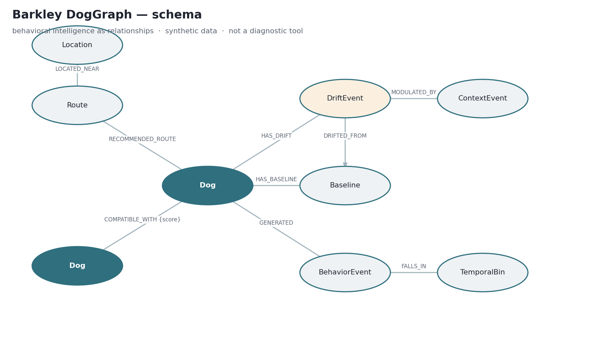
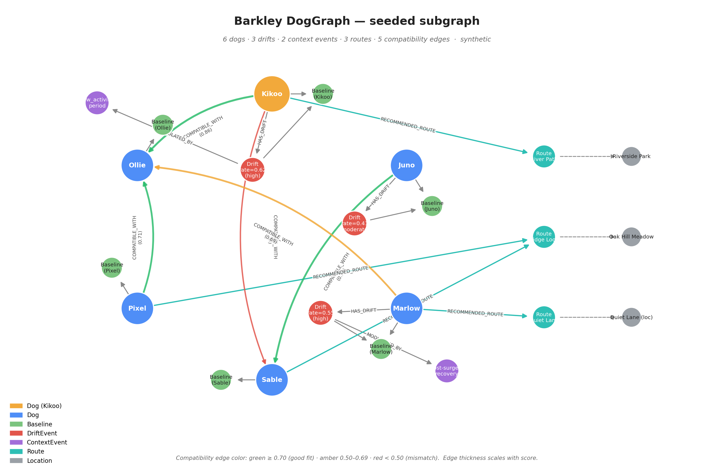

# Beyond Pet Trackers: How DogGraph Uses Neo4j to Reason Over a Dog's Behavioral Memory

*Most pet tech compares your dog to a breed average. Barkley measures each dog against **itself**, over time, in **context** — which makes the data fundamentally relational. Here's how we model a dog's behavioral memory as a Neo4j property graph: synthetic data, four queries a flat tracker can't answer, and an honest natural-language layer (no LLM hand-waving).*

> 🔗 **Try it live:** **[barkley-doggraph.streamlit.app](https://barkley-doggraph.streamlit.app/)** — the same code that lives in this folder, talking to a real AuraDB instance, with the LLM/GraphRAG layer enabled. Ask in natural language; the app shows the generated Cypher, the rows it returned, and the grounded answer. Nothing is mocked.

---

## The problem: a flat snapshot can't see an individual changing

Pet wearables and apps mostly store flat time-series and benchmark each dog against breed or age averages. That framing hides the one signal that actually matters for early intervention: a specific dog drifting away from *its own* established pattern.

"Normal for a Border Collie" tells you nothing about whether *this* Border Collie is becoming more restless, sleeping worse, or withdrawing socially compared to how it was three months ago. Two structural blind spots follow:

- **Population framing erases the individual.** The reference point is a cohort, not the dog in front of you.
- **Context is thrown away.** A dip in activity during a known post-surgery recovery is not the same as an unexplained dip — but a flat table treats them identically.

Barkley's thesis is that behavioral health is *individual-referenced, longitudinal, and contextual*. The moment you take that seriously, your data stops looking like a spreadsheet and starts looking like a graph.

## Why a graph — and why this isn't "Neo4j bolted onto a tracker"

A dog's behavioral state is relational by nature: it relates to its **own baseline**, to the **contexts** it lives in, to the **drift** it exhibits, to the **routes and places** that suit its current state, and to the **other dogs** it's compatible with. Every question worth asking is a traversal:

- *Is this dog drifting from its own baseline?* → `Dog → DriftEvent → Baseline`
- *Is that change explained by context?* → `DriftEvent → ContextEvent`
- *Which route fits its current state?* → `Dog → Route → Location`
- *Which dog is it compatible with, and why?* → `Dog → COMPATIBLE_WITH → Dog`

A relational database answers these with expensive joins and a lot of lost meaning. A property graph answers them natively. That's the honest fit: **DogGraph is the intelligence layer, and a graph is its natural shape** — not a tracker with a graph database stapled on for a sponsor badge.

## The DogGraph schema

The model encodes Barkley's primitives as nodes and relationships. Built on **Neo4j AuraDB** (free tier), **synthetic data only**.

**Nodes:** `Dog`, `Baseline` (the dog's *Individual Cognitive Fingerprint*), `TemporalBin` (circadian / weekly / quarterly resolutions), `BehaviorEvent`, `ContextEvent` (contextual signals used by Barkley's "Sovereignty of Silence" framing), `DriftEvent`, `Route`, `Location`.

**Relationships:**

```cypher
(:Dog)-[:HAS_BASELINE]->(:Baseline)
(:Dog)-[:GENERATED]->(:BehaviorEvent)-[:FALLS_IN]->(:TemporalBin)
(:Dog)-[:HAS_DRIFT]->(:DriftEvent)-[:DRIFTED_FROM]->(:Baseline)
(:DriftEvent)-[:MODULATED_BY]->(:ContextEvent)
(:Dog)-[:RECOMMENDED_ROUTE {reason}]->(:Route)-[:LOCATED_NEAR]->(:Location)
(:Dog)-[:COMPATIBLE_WITH {score, reason}]->(:Dog)
```

Constraints keep node identity clean:

```cypher
CREATE CONSTRAINT dog_id        IF NOT EXISTS FOR (d:Dog)        REQUIRE d.id IS UNIQUE;
CREATE CONSTRAINT baseline_id   IF NOT EXISTS FOR (b:Baseline)   REQUIRE b.id IS UNIQUE;
CREATE CONSTRAINT driftevent_id IF NOT EXISTS FOR (x:DriftEvent) REQUIRE x.id IS UNIQUE;
// ... one per node label
```



The point: *"drifting from itself"*, *"explained by context"*, *"compatible with"*, and *"right route for current state"* are all **relationship** questions — exactly what a graph is built to answer.

## Four queries a flat tracker can't answer

Our focus dog is **Kikoo**, a Jack Russell with an elevated, context-modulated drift.

**1. Which dogs are drifting from their own baseline?** (individual-referenced, not a population comparison)

```cypher
MATCH (d:Dog)-[:HAS_DRIFT]->(x:DriftEvent)-[:DRIFTED_FROM]->(:Baseline)
RETURN d.name AS dog, x.rate AS drift_rate, x.severity AS severity
ORDER BY x.rate DESC;
```

**2. Which drifts are explained by context vs. unexplained?** (the Sovereignty of Silence: a context-explained change is calm; an unexplained one earns a closer look)

```cypher
MATCH (d:Dog)-[:HAS_DRIFT]->(x:DriftEvent)
OPTIONAL MATCH (x)-[:MODULATED_BY]->(c:ContextEvent)
RETURN d.name AS dog, x.rate AS drift_rate,
       CASE WHEN c IS NULL THEN 'UNEXPLAINED — review'
            ELSE 'explained by context' END AS status,
       c.type AS context
ORDER BY (c IS NULL) DESC, x.rate DESC;
```

**3. Which route fits Kikoo's current state, and why?** (recommendation as a function of present state — elevated drift → calmer, flatter route)

```cypher
MATCH (d:Dog {name:'Kikoo'})-[rr:RECOMMENDED_ROUTE]->(r:Route)-[:LOCATED_NEAR]->(l:Location)
OPTIONAL MATCH (d)-[:HAS_DRIFT]->(x:DriftEvent)
RETURN d.name AS dog, r.name AS route, r.intensity AS intensity,
       l.name AS near, rr.reason AS why, x.severity AS current_drift;
```

**4. Which dog is socially compatible with Kikoo, and why?** (a scored, *explained* relationship)

```cypher
MATCH (k:Dog {name:'Kikoo'})-[c:COMPATIBLE_WITH]->(other:Dog)
RETURN other.name AS candidate, c.score AS compatibility, c.reason AS why
ORDER BY c.score DESC;
```

Each one is a short traversal. The same questions in a flat schema mean self-joins, windowing, and reconstructing relationships the graph stores directly.

## A schema-constrained GraphRAG layer

We added two natural-language layers on top of the schema. Both ship in the same folder; only one is opt-in.

### Deterministic intent router (`graph_query.py`)

A small router that maps a question to one of four *audited, parameterised* Cypher queries:

```bash
python ask.py "Is Kikoo's drift explained by context, or should I worry?"
```

No LLM, no surprises. Predictable enough for sensitive demos.

### LLM + GraphRAG (`graph_query_llm.py`)

The opt-in upgrade. The pipeline is precisely:

```
question
  → Claude (system prompt: full DogGraph schema, few-shots, read-only rule, OUT_OF_SCOPE escape)
  → Cypher
  → validate_readonly()                ← refuses CREATE / MERGE / DELETE / SET / REMOVE / DROP / DETACH / LOAD CSV / ...
  → execute on Neo4j AuraDB            ← retrieval = graph traversal
  → rows
  → Claude (system prompt: "ground answer strictly in these rows")
  → natural-language answer
```

This is GraphRAG in the strict sense — retrieval is the graph traversal and generation is grounded on the retrieved rows, not free-form LLM-with-a-database. Two layers of safety: the system prompt states the read-only rule and the schema; the post-hoc validator scans the emitted Cypher and **refuses** anything that contains a write keyword, even if the LLM ignored its instructions. No write ever reaches the database. If `ANTHROPIC_API_KEY` is unset, the layer transparently falls back to the deterministic router.

```bash
export ANTHROPIC_API_KEY="<your-key>"
python ask.py --llm "Which dog has the highest unexplained drift?"
```

### Streamlit app (`app.py`)

The same pipeline behind a small Streamlit UI: question → generated Cypher (always shown) → grounded answer → raw rows. Aura-connected. **Live deployment:** **[barkley-doggraph.streamlit.app](https://barkley-doggraph.streamlit.app/)** — the code is the contents of this folder, the AuraDB is real, the secrets sit in Streamlit Cloud's secret store. Nothing is mocked.



Honesty about capability is the whole point of Barkley: the LLM step is now implemented as a schema-constrained, read-only validated GraphRAG layer over a synthetic Neo4j DogGraph — opt-in, bounded by the seed, and not a production or diagnostic agent.

## What this unlocks

Once behavior lives in a graph, Barkley's primitives become *queries*, not bespoke code:

- **Individual baselines** — each dog referenced to itself, not a breed average.
- **Rate-of-drift** — change measured against the individual's own trajectory.
- **Context-aware interpretation of silence** — distinguishing artefactual gaps from informative ones.
- **State-aware recommendations** — routes matched to present behavioral state.
- **Explained social compatibility** — scored, reasoned pairings.

All of it: traversals over a single, connected behavioral memory.

This demo was built as a small Neo4j / AuraDB proof-of-usefulness layer on top of Barkley's existing synthetic DogGraph ecosystem.

## Reproduce it in ~5 minutes

### Or just try the live app

Skip the setup and go straight to the live demo: **[barkley-doggraph.streamlit.app](https://barkley-doggraph.streamlit.app/)**. Same code as this folder, real AuraDB instance, schema-constrained GraphRAG enabled.

### Run it yourself

1. Create a free **Neo4j AuraDB** instance.
2. In Neo4j Browser, run `schema.cypher`, then `seed_synthetic.cypher`, then `queries.cypher`.
3. Run the bonus query (Kikoo's neighbourhood) and explore the graph visually.

The synthetic graph is generated by `generate_seed.py` (seed = 42), so it's fully reproducible — and no real animals are involved.

## Links

- **Live DogGraph app (Streamlit, GraphRAG):** https://barkley-doggraph.streamlit.app/
- **Live demo (Drift Explorer):** https://drift-explorer.getbarkley.com/
- **Neo4j DogGraph demo (code):** https://github.com/labs-barkley/barkley-canine-cognition-lab → `neo4j-doggraph-demo/`
- **Reference architecture:** https://github.com/labs-barkley/barkley-reference-architecture
- **Synthetic dataset:** https://huggingface.co/datasets/labs-barkley/synthetic-doggraph-sample
- **Archived DOI (Zenodo):** [](https://doi.org/10.5281/zenodo.20369863)
- **ORCID:** https://orcid.org/0009-0004-6031-659X

---

*Disclaimer: synthetic data only. Research demonstrator. Not a diagnostic tool, not validated on real animals, and not for veterinary decision-making. Certain Barkley methods are the subject of filed patent applications.*

---

**Tags:** #proof-of-usefulness #neo4j #graph-database #knowledge-graph #graphrag #graph-powered-agents #machine-learning #synthetic-data #pet-tech
